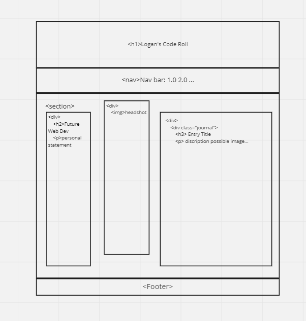

# Journal
Journal is an app which if used to showcase new skills and techniques learned in the front end of the C47 bootcamp. Stay tuned for updates and developeling code!

## Focus areas
* HTML
* Javascript
* Json
* Postman

## Wireframe


```bash
const showjournalentries = () => {
    const postElement = document.querySelector("#journal");
      getjournalentry().then((allPosts) => {
          postElement.innerHTML = getJournal(allPosts);
      })
}

```

## Usage
Open to 

## License
&copy; Logan Demmy 2021